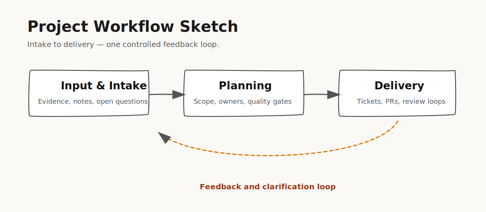

# Project

> Stage: `project` | Status: `active` | Created: `2026-04-28`

This page is the canonical stage brief for stakeholders and contributors.
It explains the current project focus in plain language, why this matters now,
which boundaries are active, and what the next decision-relevant steps are.

## What This Stage Means

The Project stage translates validated input into actionable delivery.
In practical terms: priorities are narrowed, tasks are prepared for execution,
and review gates define what can move forward and what must be clarified first.

## Summary

The Project stage aligns validated context into a coherent, delivery-ready project report.
This cycle aims to ensure that at least one thematic epic can be derived from aggregated context, blocking contradictions are either resolved or tracked with owners, and recommendations and confidence from expert reviews are consolidated.

## Why This Matters

This stage creates shared orientation across technical and non-technical audiences.
If this page is clear, teams can execute faster, reviewers can approve with confidence,
and stakeholders can understand progress without reading internal task metadata.

## Focus

At least one thematic epic can be derived from aggregated context.
Blocking contradictions are either resolved or tracked with owners.
Recommendations and confidence from expert reviews are consolidated.

## What Happens Next

After focus items are active, delivery work is dispatched, implementation evidence is collected,
and review gates verify quality, approval, and completion criteria before final closure.

## Boundaries

Proceed only with specifications that have a positive cumulated review.
Keep all downstream artifacts in English.

## Delivery Status

- Status: active
- Last update: 2026-04-28
- Interpretation: The stage is actionable when goals and constraints are explicit and testable.

## How To Read This Page

1. Start with Summary and Why This Matters to understand intent.
2. Use Focus to see what is currently being executed.
3. Use Boundaries and Delivery Status to understand risk and decision gates.
4. Use Planning Snapshot and linked assets below for implementation depth.

## Board

See the synchronized board metadata in [.digital-artifacts/40-stage/PROJECT.md](../../.digital-artifacts/40-stage/PROJECT.md).

## Last Updated

2026-04-28

## Planning Snapshot

- Epic: EPIC-THM-01 [open] - Project Delivery Execution (THM-01)
- Story: STORY-THM-01 [open] - Define executable work packages for Project Delivery Execution (THM-01)
- Task: TASK-THM-01 [in-progress] - Implement approved scope for Project Delivery Execution (THM-01)

## Visual Walkthrough

### Simplified Workflow

Executive-level workflow view with clean structure and one explicit feedback loop.

[Open SVG file](assets/scribbles/project-workflow-scribble.svg)

## Stakeholder Briefing

- [Download stakeholder presentation](Project-Stakeholder-Briefing.pptx)
